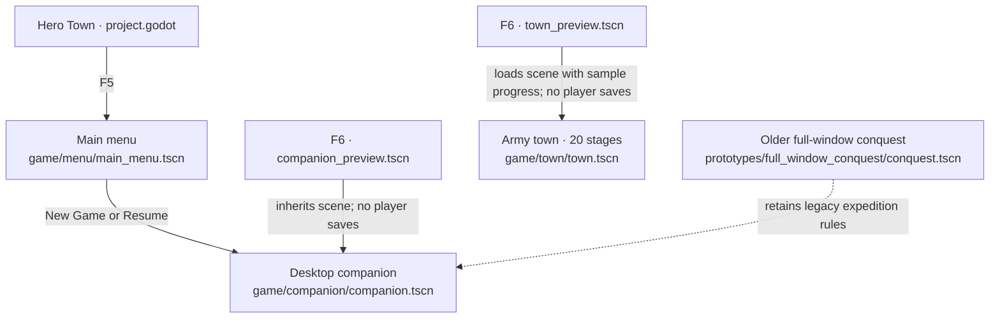
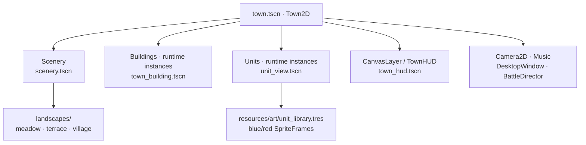
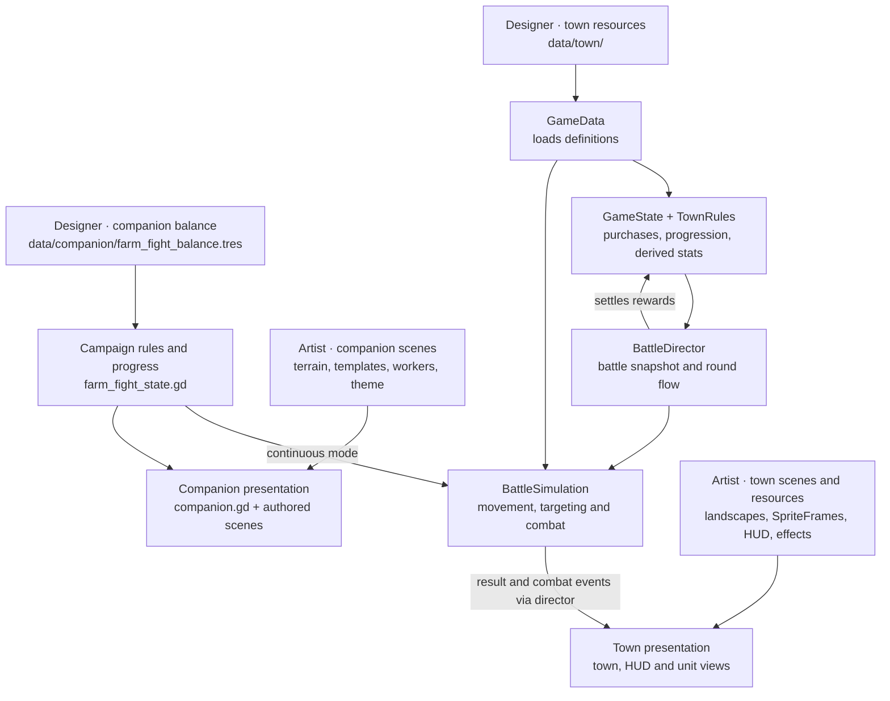

# Hero Town — designer & artist onboarding map

Start here to find the scene or resource behind a visible feature. This map describes the checked-in game as of 18 September 2026. Open `project.godot` in Godot 4.6.3. Paths below are relative to the project root; Godot displays them with a `res://` prefix.

## 1. Choose the right game mode



**The main menu currently opens the companion.** Army town is a separate mode, reached by opening its scene or preview in the editor. The prototype is retained for reference. There is no menu route shown here between companion and army town.

| | Desktop companion | Army town |
| --- | --- | --- |
| Player loop | Assign gold/wood farmers → construct/upgrade hero towers → continuous waves → capture richer land → repeat | Place army buildings → auto-battle → earn gold → upgrade crew/rarity/training → challenge or farm |
| Current encounters | Endless frontier cycling Meadow, Quarry, and River layouts | 20 stages; captains at 5, 10, 15, 20 |
| Main tuning source | [farm_fight_balance.tres](../data/companion/farm_fight_balance.tres) | [data/town/](../data/town/) |
| Progress owner | [farm_fight_state.gd](../game/companion/farm_fight_state.gd), owned by companion | [game_state.gd](../game/town/game_state.gd), the `GameState` autoload |
| Normal save | `user://farm_fight_v1.json` | `user://hero_town_v1.json` |
| While fully closed | Progress pauses; no offline catch-up | Eligible previous victories establish capped offline gold income |

## 2. Your first 10 minutes

1. Open [companion_preview.tscn](../game/previews/companion_preview.tscn) and press **F6**. Disable **Embed Game on Play** so the native desktop window can position itself.
2. Watch the starting Warrior and barracks hold the frontline. Follow the guide to assign farmers at the gold outcrop/forest grove, select an upgrade in the connected Research tree, then fold and restore the companion.
3. Stop the preview. Open [companion.tscn](../game/companion/companion.tscn) and expand `Settlement/TownDistrict` to connect visible buildings to scene nodes.
4. Designers: inspect [farm_fight_balance.tres](../data/companion/farm_fight_balance.tres). Artists: open [farm_terrain.tscn](../game/companion/farm_terrain.tscn) and inspect its TileMapLayers.
5. Save a small edit and run the preview again. For army-town work, use [town_preview.tscn](../game/previews/town_preview.tscn), which starts with sample gold and two armies.

The two named previews bypass player-save loading/writing. Base gameplay scenes use their regular saves. Edit the base scene for a shared change; companion-preview overrides are experiments. Changes in Godot's **Remote** tree disappear when the run ends.

## 3. Companion: what you see → where it lives

```text
game/companion/companion.tscn
FarmFightCompanion
├─ Settlement
│  ├─ Lands                          Visible/adjacent farm-land instances
│  └─ TownDistrict                   Active frontier, relocates on conquest
│     ├─ RearDefense                 Safe boundary
│     ├─ Towers                      Warrior, Monk, Archer, Lancer + Spawn markers
│     ├─ Formation                   Runtime soldier views
│     ├─ DamageNumbers               Runtime feedback
│     └─ Enemy                       Enemy tower, HP, wave countdown
├─ HUD                               Resources, rates, navigation, window controls
├─ ManagementPanel                   Farm, Tower, Research
└─ TaskbarSparring                    Cosmetic folded view; simulation continues
```

| I want to change… | Open/select | What it controls |
| --- | --- | --- |
| Economy, classes, waves, difficulty | [farm_fight_balance.tres](../data/companion/farm_fight_balance.tres) | Starting state, prices, yields, stats, caps, spawn intervals, land scaling |
| Campaign rules and persistence | [farm_fight_state.gd](../game/companion/farm_fight_state.gd) | Farmer assignments, transactions, upgrades, spawning, conquest, saves |
| Combat | [battle_simulation.gd](../game/town/battle_simulation.gd) | Shared movement, targeting, abilities; opt-in continuous frontier mode |
| Ground and cliffs | [farm_terrain.tscn](../game/companion/farm_terrain.tscn) | Native painted terrain; default 1440-pixel land width |
| Land composition | [farm_land.tscn](../game/companion/farm_land.tscn), [farm_quarry.tscn](../game/companion/farm_quarry.tscn), [farm_river.tscn](../game/companion/farm_river.tscn) | Resource positions and scenery; variants repeat along the frontier |
| Worker artwork | [gold_spot.tscn](../game/companion/gold_spot.tscn), [wood_spot.tscn](../game/companion/wood_spot.tscn) | Resource sprites, worker templates, interaction targets and animation clips |
| Hero tower appearance/spawning position | Companion → `Settlement/TownDistrict/Towers` | Move whole class group, including its Spawn marker |
| Soldier animation | [unit_library.tres](../resources/art/unit_library.tres), [unit_view.tscn](../game/town/unit_view.tscn) | Shared Warrior/Monk/Archer/Lancer art and presentation |
| HUD and management panels | Companion → `HUD`, `ManagementPanel` | Native container layout, fonts, themes; current values come from state |
| Folded duel | [taskbar_sparring.tscn](../game/companion/taskbar_sparring.tscn) | Cosmetic poses and timing |
| Combat numbers | [combat_number.tscn](../game/companion/combat_number.tscn), companion Presentation exports | Number appearance and damage/healing colors |

Farmer assignments determine real income. Worker animation does not control harvest timing. Combat is simulated continuously, including while panels are open or the window is folded. Closing pauses the campaign; resume does not award offline progress.

Home and conquered lands retain assignments even when their scenes are unloaded. Only the active frontier has moving combatants. Territory is indexed independently of scenery, with stable local combat coordinates. Old expedition files remain available to the retained prototype and are not converted.

## 4. Army town: scene and content map



Scene filenames in this diagram are inside `game/town/` unless another folder is shown. `Buildings` and `Units` are populated from game state; edit their templates to change the spawned objects.

| I want to change… | Open | What this controls |
| --- | --- | --- |
| Terrain, props, roads, water | [landscapes/](../game/town/landscapes/) | Authored scenery; choose **Preview Landscape** on [scenery.tscn](../game/town/scenery.tscn) to inspect it |
| Building appearance | [town_building.tscn](../game/town/town_building.tscn) and [buildings/](../data/town/buildings/) | Shared presentation plus per-building sprite/thumbnail and cost |
| Soldier poses and animation | [unit_library.tres](../resources/art/unit_library.tres) and [resources/art/](../resources/art/) | Warrior, lancer, archer, monk; blue/red SpriteFrames |
| Soldier scale, smoothing, death effect | [unit_view.tscn](../game/town/unit_view.tscn), [death_dust.tscn](../game/town/death_dust.tscn) | Presentation of simulation-controlled units |
| Hero and enemy stats | [heroes/](../data/town/heroes/), [enemies/](../data/town/enemies/) | Authored combat definitions |
| Upgrade titles, costs and values | [research/](../data/town/research/) | Crew, rarity, damage, health, haste, specialty resources |
| Enemy formations, rewards, time limits | [stages/](../data/town/stages/) | `stage_01.tres` through `stage_20.tres` |
| HUD, panels and typography | [town_hud.tscn](../game/town/town_hud.tscn) | Static controls and responsive settings; scripts fill current values |

Display names and internal IDs differ in two places: **Ranger Range uses `mage_tower`**, and **Lancer Lodge uses `rogue_den`**. Keep those IDs stable. The art-library keys are `warrior`, `lancer`, `archer`, and `monk`; Ranger and Cleric use archer/monk artwork. Extra resources for Tavern, Blacksmith and Portal do not mean those features are active in this mode's UI.

## 5. How authored content becomes the game

Arrows below mean “supplies data or behavior,” not screen navigation.



| Layer | Where | Practical ownership |
| --- | --- | --- |
| Source media | `asset/`, `fonts/` | Original art/audio packs and fonts; preserve originals and assign replacement assets in scenes/resources |
| Reusable presentation | `resources/art/`, `resources/ui/`, `resources/effects/`, `vfx/` | Animation libraries, themes and effects; changing a shared resource affects its users |
| Authored composition | `game/menu/`, `game/companion/`, `game/town/` | Scene layout, art references and exported presentation controls |
| Tuning | `data/companion/`, `data/town/` | Existing gameplay values; `.tres` resources are editable in the Inspector |
| Rules and persistence | Scripts beside scenes; `data/*` schema scripts | Programmer changes for new mechanics, resource fields, save behavior or tactical rules |
| Preview and verification | `game/previews/`, `tests/` | Safe visual iteration and behavior checks |
| Historical/reference material | `prototypes/`, `docs/archive/` | Previous implementations and plans; verify against current scenes before using |

`.tscn` = scene, `.tres` = resource, `.gd` = script, `.gd.uid` = script identity. `GameData`, `GameState`, `fx` and `sfx` are registered in [project.godot](../project.godot); the companion owns its FarmFightState separately. `game/shared/` contains display-sizing and sound helpers. `addons/` contains third-party editor tools. `.godot/` holds generated imports and local check outputs.

## 6. Make a change that survives handoff

1. Pick the mode and the source scene/resource from the tables. For menu work, open [main_menu.tscn](../game/menu/main_menu.tscn): artwork is under `MainMenuScene`, and buttons are under `front_ui/Layout`.
2. Change existing Inspector values or authored nodes. Preserve linked node names, references, resource IDs, signal connections, and animation names such as `idle`, `run`, `attack`, and existing `guard` clips.
3. Save, stop, and rerun the corresponding F6 preview. Check the object at compact size and with panels expanded; for combat art, observe automatic waves as well.
4. In the handoff, include the mode, changed paths, the intended visible/balance change, and what you checked. Use [test commands](../tests/README.md) when gameplay rules or resource loading are affected.

**Common surprises:** the companion and town share soldier SpriteFrames; worker and folded-duel art use their own templates. Container-managed UI needs spacing/minimum-size/theme edits rather than dragged child positions. Existing saves retain progress, so starting-value changes need a fresh preview. Companion land variants repeat by territory index; use a fresh preview to test new starting balance. Adding town stage 21 needs code because loading and progression currently stop at 20.

For detailed Inspector controls, use [Editing Hero Town](EDITOR_WORKFLOW.md). For player behavior, use [Desktop companion](COMPANION.md) or [Army town](TOWN.md). Keep this map updated when entry scenes, node groups, data ownership, or preview behavior change.
