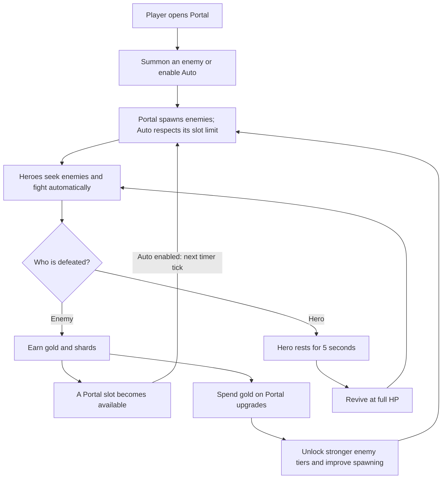
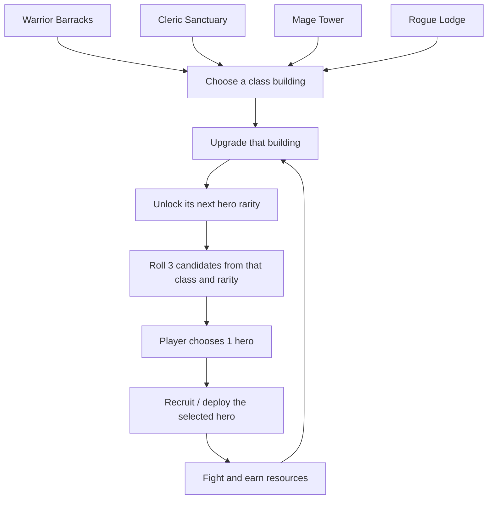
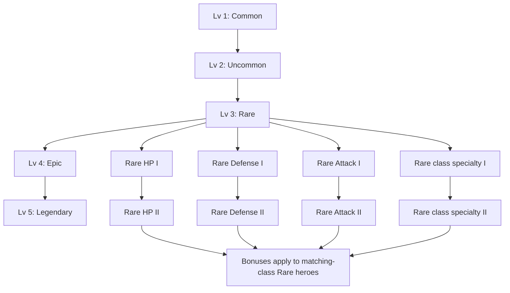
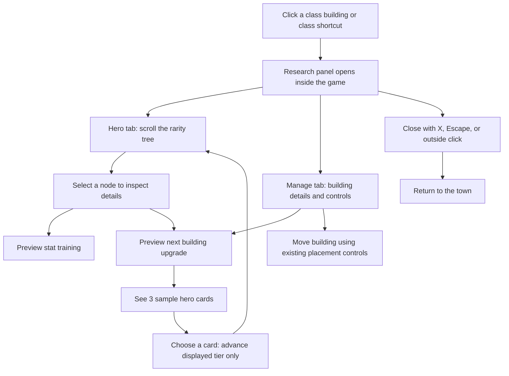

# Hero Town workflows

The game is an idle town builder: heroes fight automatically while the player manages buildings and progression. The diagrams below separate working gameplay from the proposed research system. **The class research interface currently previews progression; it does not execute it.**

## 1. Idle combat and rewards — implemented

Currently the existing Barracks spawns the warrior squad. The other three class buildings are present for UI review; their recruitment and squad mechanics are not connected. Enemy drops use their authored gold/shard ranges. Portal summoning and Auto controls remain in the existing Portal panel.

## 2. Building upgrades and hero choice — planned gameplay

Gacha belongs to the building-upgrade reward, with no separate recruitment purchase in this design. Costs, candidate pools, probabilities, deployment rules, and persistence still need gameplay implementation. The current preview shows fixed sample cards instead of random draws.

## 3. Rarity-specific research — planned effects, current visual tree

Rare is shown as one example; each rarity has its own branches. The UI has five building milestones and forty stat nodes per class. The fourth branch shows skill power for Warrior/Mage, agility for Rogue, and healing for Cleric. These are presentation labels, not implemented combat effects. Rank prerequisites, values, and research prices remain to be designed and connected.

## 4. Research UI navigation — implemented preview

Training and hero-choice previews never change currencies, actual building levels, or hero stats/counts. Reopening or switching class resets preview state. In Compact mode the same game area temporarily expands for research, then returns to its prior size on close. No separate research window is created.

See [Class research UI](CLASS_RESEARCH_UI.md) for the editable scenes and future gameplay integration points.
